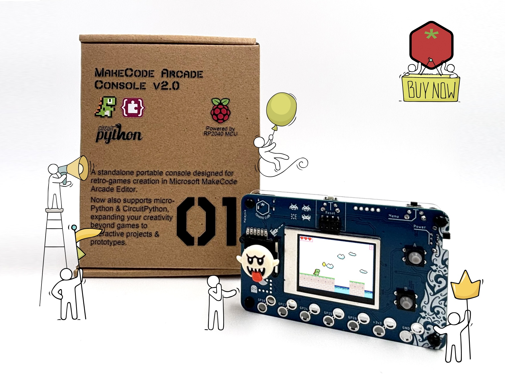
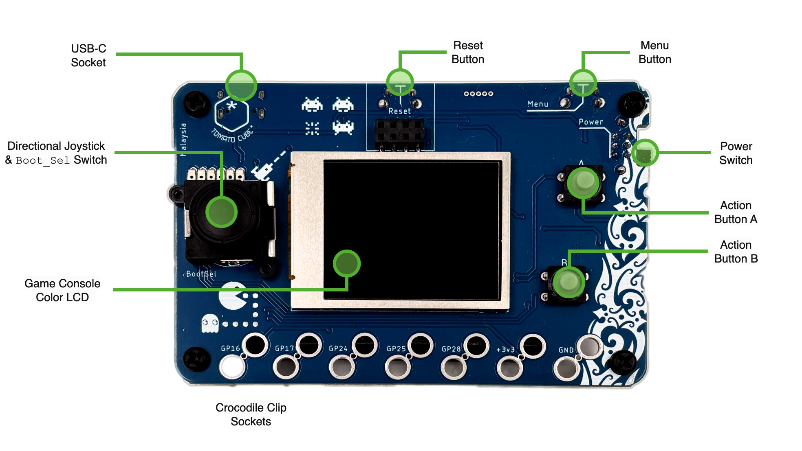
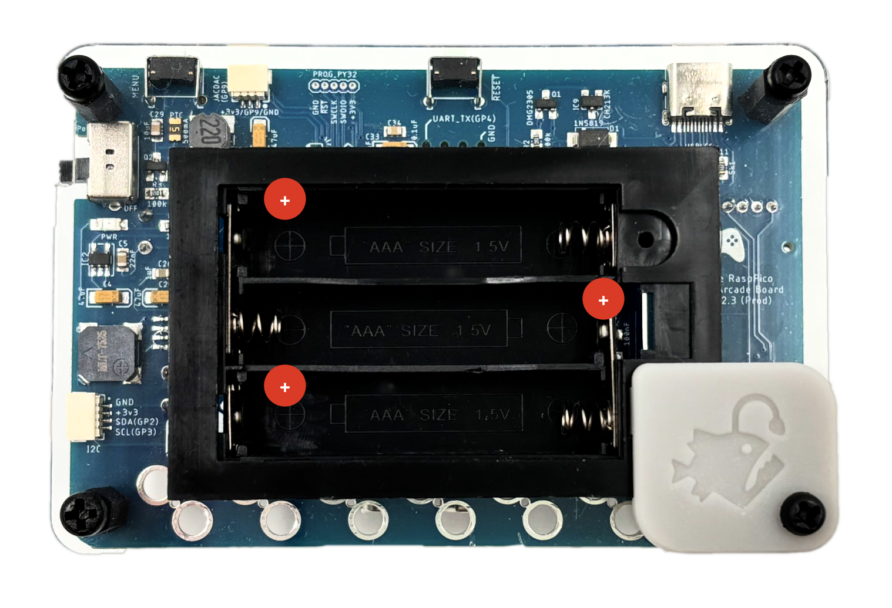
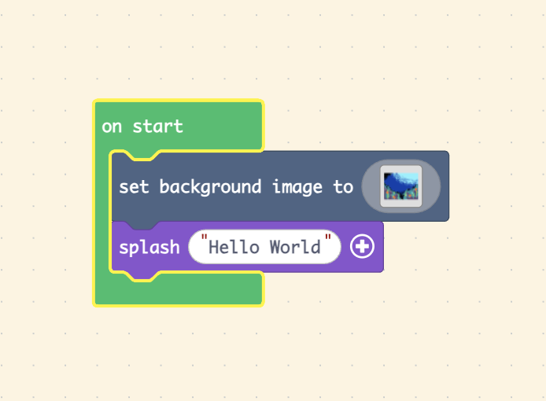

# 🎮 **Quick Start Guide**

## MakeCode Arcade Console v2.0 (RP2040)



Welcome to your brand-new **MakeCode Arcade Console powered by the Raspberry Pi RP2040**!
This guide will help you get your first game running in just a few minutes.


------

## **0. Major Components on the Console**



### **(A) Joystick & BOOTSEL Switch**

This joystick is used for **directional movement** in games (up, down, left, right).<br>
Pressing the joystick **down like a button** activates the **BOOTSEL function** of the RP2040, which is used when loading new firmware or MakeCode Arcade programs.<br>
In normal gameplay, the joystick works like a standard D-pad.

### **(B) Color LCD Screen**

A bright full-color LCD display used to show all game graphics, menus, animations, and text.<br>
This is where your **Hello World** message and all future games will appear.

### **(C) USB-C Port (Power & Programming)**

Used for **powering the console** from a USB charger or powerbank.<br>
Also used to **connect the console to your computer** when loading new MakeCode Arcade games, the configuration UF2, or Python interpreters.

### **(D) Reset Button**

Located on the top of the console.<br>
Pressing **Reset** restarts the RP2040.<br>
When pressed while holding the joystick (BOOTSEL), it puts the console into firmware-loading mode.<br>
Useful for refreshing or rebooting the system.

### **(E) Menu Button**

Opens the **in-game menu** during gameplay.<br>
This typically includes options like **Screen Brightness Control**, **Sound Volume control**, or game-specific settings depending on how the game is programmed.

### **(F) Power Switch**

Turns the console **ON** or **OFF**.<br>
The console runs on **3× AAA batteries**, and the switch allows you to conserve power when not in use.<br>
(You may use either standard or rechargeable AAA batteries.)

### **(G) Action Buttons A & B**

These are the main **gameplay action buttons**.<br>
Used for jumping, selecting items, triggering abilities, confirming actions, or any function programmed by the game.<br>
Most MakeCode Arcade games rely on these two buttons for player interaction.<br>


------


## **1. Powering the Console**

Your console requires **3× AAA batteries** (standard or rechargeable).
Insert them into the battery compartment, matching the +/– markings.



------

## **2. Default Mode (Out of the Box)**

Your console ships in **MakeCode Arcade Mode**.<br>
You can immediately load games created in MakeCode Arcade.

If you **have NOT used microPython or CircuitPython** on this console, you can skip to Step 4.<br>

------

## **3. (Only If Needed) Restore MakeCode Arcade Configuration UF2**

If you previously loaded **microPython** or **CircuitPython**, you must restore the **MakeCode Arcade configuration UF2**.

**To enter BOOTSEL mode:**

1. **Press & hold the BOOTSEL button**<br>
   – on this console, BOOTSEL = **pressing down the left/analog joystick**.
2. While holding BOOTSEL, **press RESET**<br>
   – the RESET button is located **on the top of the console**.
3. Release everything — a USB drive called **RPI-RP2** appears.
4. Copy the **MakeCode Arcade Configuration UF2** - **[TomatoCubeMakeCode_cfg1x2_v2.uf2](../Files/TomatoCubeMakeCode_cfg1x2_v2.uf2)** into the **`RPI-RP2`**  drive.
5. After restarting, the console is now ready for any **MakeCode Arcade Game**.

💡You only ever need to do this **after switching away to either microPython & circuitPython modes**.<br>

------

## **4. Create Your First Game (“Hello World”)**

1. On your computer, open a browser.

2. Go to **[https://arcade.makecode.com](https://arcade.makecode.com/)**

3. Click **New Project**

4. Name your project **Hello World**

5. In the Blocks editor:

   - Open **Scene** → Drag "**set background image to**" into the **on start block** found on your workspace.
   - Click on the empty **white square** and pick a background image from **gallery** to your liking.
   - Open **Game** →Drag "**splash**" into the **on start block** under the "**set background image to **" block
   - Key in **"Hello World"** into the **splash** block.
   - The final code should appers as follow:

   

6. Press the **Play** button to test it in the simulator.<br>

------

## **5. Download Your Game to the Console**

When you’re ready to load the game:

### **Step A — Enter BOOTSEL Mode**

1. Press & hold **Joystick (BOOTSEL)**<br>
   – on this console, BOOTSEL = **pressing down the left/analog joystick**.
2. While holding BOOTSEL, **press RESET**<br>
   – the RESET button is located **on the top of the console**.
3. Release → **RPI-RP2** drive appears on your computer

### **Step B — Download from MakeCode Arcade**

1. Click **Download**
2. When asked for a device, choose:<br>
   **“R2 – Board based on Raspberry Pi RP2040”**
3. You will get a **.UF2 file**
4. Drag the **.UF2** into the **RPI-RP2** drive
5. The console restarts and your game runs immediately!

------

## **6. MakeCode Arcade - You’re Ready to Play!**

Your game should now appear on the console screen.<br>
Experiment, explore, and try creating your own sprites and controls next!<br>


------

## **7. Using MicroPython & CircuitPython on MakeCode Arcade Console v2.0 (RP2040)**

This rest of the guide shows you how to:

- Install **MicroPython** (via Thonny)
- Optionally install **CircuitPython**
- Run a simple **“Hello from Python!”** test on your console

> ⚠️ **Important:**
> When you install MicroPython or CircuitPython, you **overwrite** the MakeCode Arcade firmware.<br>
> To play Arcade games again, you must re-flash the **MakeCode configuration UF2** (see section 3 "Restore MakeCode Arcade Configuration UF2").<br>

------

## 8. What You Need

- Your **MakeCode Arcade Console v2.0 (RP2040)**
- **USB-C cable** (data-capable)
- A computer with:
  - **Thonny** installed ([https://thonny.org](https://thonny.org/))
  - Internet access (for the first-time MicroPython install)<br>

------

## 9. Put the Console in BOOTSEL Mode

We use BOOTSEL mode to install or change the firmware.

1. Make sure the console is **powered ON** (batteries inserted, power switch ON).
2. Connect the console to your computer via **USB-C**.
3. **Press & hold the joystick** (this is the **BOOTSEL** button).
4. While holding the joystick, **press the RESET button** on top of the console.
5. Release both.

Your computer should now show a new USB drive named **`RPI-RP2`**.

If you don’t see it, repeat the steps above.<br>

------

## 10a. Install MicroPython using Thonny

We’ll use Thonny’s built-in tool to install MicroPython onto the RP2040.

1. **Open Thonny** on your computer.
2. Go to **`Tools → Options…`**
3. Click the **Interpreter** tab.
4. In the *Interpreter* drop-down, choose:<br>
   **`MicroPython (Raspberry Pi Pico)`** or **`MicroPython (RP2040)`**
5. Click the underlined-text(button) **"Install or update MicroPython"**.
6. In the pop-up:
   - Make sure the target is your **RPI-RP2** device.
   - The MicroPython family will automatically be set as **RP2**.
   - Choose the variant **Raspberry Pi - Pico / Pico H**
   - Choose the latest **MicroPython for RP2040** firmware. (1.26.1 as of writing)
7. Click **Install** and wait until it finishes.
8. When done, close the dialog and **unplug and replug** the USB-C cable, or press **RESET**.

Now the console is running **MicroPython**.<br>
Thonny should show something like a `>>>` prompt (the Python REPL).<br>

### Test MicroPython: “Hello from Python!”

1. In Thonny, make sure the correct interpreter is still selected:

   - **`MicroPython (Raspberry Pi Pico)` / RP2040**

2. At the bottom, in the **Shell** (the `>>>` prompt), type:

   ```
   print("Hello from MicroPython!")
   ```

3. Press **Enter** → You should see:

   ```
   Hello from MicroPython!
   ```

This confirms your console is talking to MicroPython correctly 🎉<br>

------

## 10b. (Altenatively) Install CircuitPython using Mass Storage

You can also run **CircuitPython** on this console.<br>
We’ll still use **Thonny** as the code editor, but CircuitPython is installed using a UF2 file.

1. Put the console into **BOOTSEL mode** again

   - Hold **Joystick (BOOTSEL)**
   - Press **RESET**
   - Release → **`RPI-RP2`** drive appears

2. Download the latest **CircuitPython UF2 for RP2040** from the official site [Adafruit’s "Download for Raspberry Pi Pico / RP2040"](https://circuitpython.org/board/raspberry_pi_pico/)

3. Drag and drop the **CircuitPython `.uf2` file** into the **`RPI-RP2`** drive.

4. The board will restart and now appear as a new drive, usually named **`CIRCUITPY`**.


### Use Thonny with CircuitPython

1. Open **Thonny**.

2. Go to **`Tools → Options… → Interpreter`**.

3. In the *Interpreter* drop-down, choose:<br>
      **`CircuitPython (generic)`** + correct serial port
      (Exact naming depends on your Computer's OS)
      
4. In Thonny’s **Files** view, you should see the **`CIRCUITPY`** drive.

5. Create a new file, e.g. `code.py`, with:

      ```
      print("Hello from CircuitPython!")
      ```

6. Save it to the **CIRCUITPY** drive as `code.py`.

Unplug and replug the console or press **RESET** — it will automatically run `code.py` and print the message to the serial console.<br>

------

## 11. Returning to MakeCode Arcade Mode

When you’re done with Python and want to go back to Arcade:

1. Put the console into **BOOTSEL mode** (Joystick + RESET).
2. On your computer, open the **`RPI-RP2`** drive.
3. Copy the **MakeCode Arcade Configuration UF2** - **[TomatoCubeMakeCode_cfg1x2_v2.uf2](../Files/TomatoCubeMakeCode_cfg1x2_v2.uf2)** into the **`RPI-RP2`** drive.
4. The console restarts in **MakeCode Arcade Mode**, ready for Arcade games again.