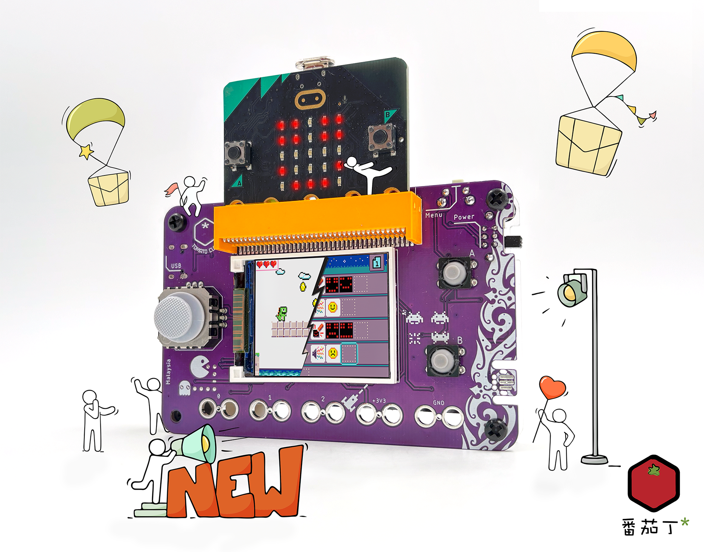
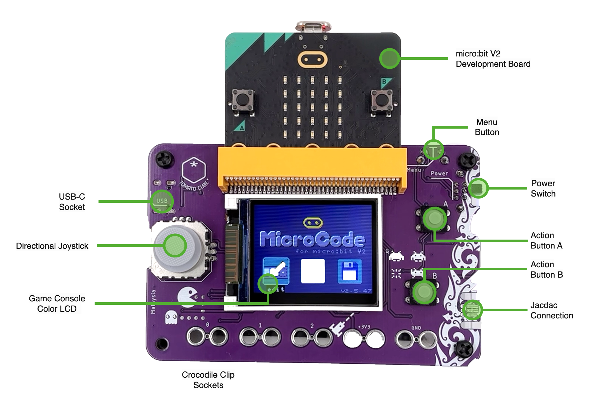
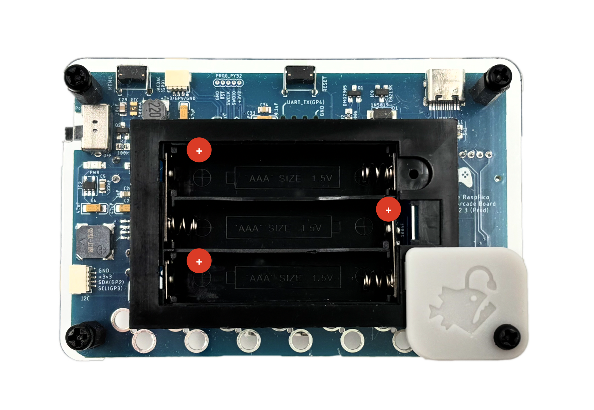
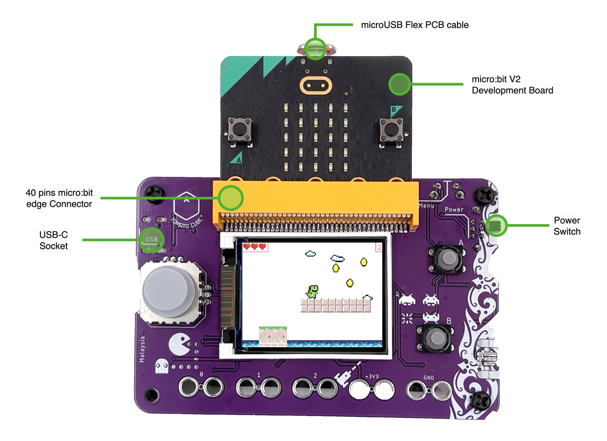
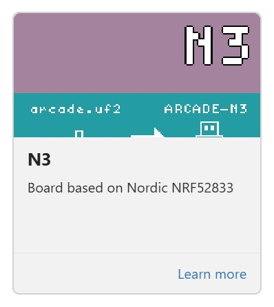

# 🎮 **Quick Start Guide**

Last Updated: 16th Dec 2025

## Arcade Display Shield for micro:bit V2 

Welcome to your brand-new **Arcade Display Shield powered by your existing micro:bit v2 development board**!
This guide will help you get your first game running in just a few minutes.

------

## **0. Major Components on the Console**

### **(A) Joystick **

This joystick is used for **directional movement** in games (up, down, left, right).
In normal gameplay, the joystick works like a standard D-pad.

### **(B) Color LCD Screen**

A bright full-color LCD display used to show all game graphics, menus, animations, and text.
This is where your **Hello World** message and all future games will appear.

### **(C) USB-C Port (Power & Programming)**

Used for **powering the console** from a USB charger or powerbank.
Also used to **connect the console to your computer** when loading new MakeCode Arcade games, the configuration UF2, or Python interpreters.

### **(D) Menu Button**

Opens the **in-game menu** during gameplay.
This typically includes options like **Screen Brightness Control**, **Sound Volume control**, or game-specific settings depending on how the game is programmed.

### **(E) Power Switch**

Turns the console **ON** or **OFF**.
The console runs on **3× AAA batteries**, and the switch allows you to conserve power when not in use.
(You may use either standard or rechargeable AAA batteries.)

### **(F) Action Buttons A & B**

These are the main **gameplay action buttons**.
Used for jumping, selecting items, triggering abilities, confirming actions, or any function programmed by the game.
Most MakeCode Arcade games rely on these two buttons for player interaction.

### **(G) Jacdac Connection**

Jacdac (from Microsoft Research) is a **low-cost, driverless hardware protocol** that lets devices like sensors, switches & actuators, to automatically identify themselves and exchange data over a small 3-pin cable with the DisplayShield. Its key purpose is to make hardware extensions **modular, discoverable, and easy to program**, without needing custom wiring or complex drivers.

## **1. Powering the Console**

Your console requires **3× AAA batteries** (standard or rechargeable).
Insert them into the battery compartment, matching the +/– markings.

------

## **2. Inserting the micro:bit v2 developoment board**

The display shield requires a micro:bit v2 development board to function. Without it, you won’t be able to load or run your existing MakeCode Arcade game projects.

Carefully insert the micro:bit v2 with the 5×5 LED matrix and buttons facing upward. The board should slide smoothly into the 40-pin edge connector located on the front of the shield. Do not force it. If aligned correctly, it will fit in effortlessly.

------

## **3. Plugging in the Flex USB connector**

Once the micro:bit is properly seated in its socket, plug the micro-USB end of the flex cable into the micro:bit’s USB port at the top. This cable provides both power and USB data for loading games onto your micro:bit.

After this, you will only need to use the USB-C socket/port on the display shield. You won’t need to unplug or access the micro:bit’s own USB port each time you want to load a new game.

Once you have verified your setup to look almost similar to the image below (minus the on screen display or the micro:bit's silkscreen color), you can then safely turned on the power switch.

------

## **4. Create Your First Game (“Hello World”)**

1. On your computer, open a browser.

2. Go to **[https://arcade.makecode.com](https://arcade.makecode.com/)**

3. Click **New Project**

4. Name your project **Hello World**

5. In the Blocks editor:

   - Open **Scene** → Drag "**set background image to **" into the **on start block** found on your workspace.
   - Click on the empty **white square** and pick a background image from **gallery** to your liking.
   - Open **Game** →Drag "**splash**" into the **on start block** under the "**set background image to **" block
   - Key in **"Hello World"** into the **splash** block.
   - The final code should appers as follow:
   

6. Press the **Play** button to test it in the simulator.

------

## **5. Download Your Game to the Console**

When you’re ready to load the game:

### **Step A - Plug in the DisplayShield to your computer**

1. Choose a suitable USB-C cable and connect the Display shield to an available USB port on your computer
2. Verify → **MICROBIT** drive appears on your computer

### **Step B - Download from MakeCode Arcade**

1. Click **Download**
2. When asked for a device, choose:
   **“N3”**
   
3. You will get a **.hex file**
4. Drag the **.hex** into the **MICROBIT** drive
5. The console restarts and your game runs immediately!

------

## **6. MakeCode Arcade - You’re Ready to Play!**

Your game should now appear on the console screen.
Experiment, explore, and try creating your own sprites and controls next!

------

## **7. Loading MicroCode onto the Display Shield**

To test out the MicroCode features on your display shield, you will need to load the MicroCode firmware onto your micro:bit. Detailed instructions and the required downloads are available at the link below:

**https://microbit-apps.github.io/microcode-classic/docs/manual**

Follow the steps in the manual to install MicroCode. Once loaded, your display shield will be ready to run MicroCode programs and interact with the micro:bit as intended.

If you are having difficulty locating the necessary hex file, we have made an English copy for you.
 [Download microcode-en.hex](../Files/microcode-en.hex) 