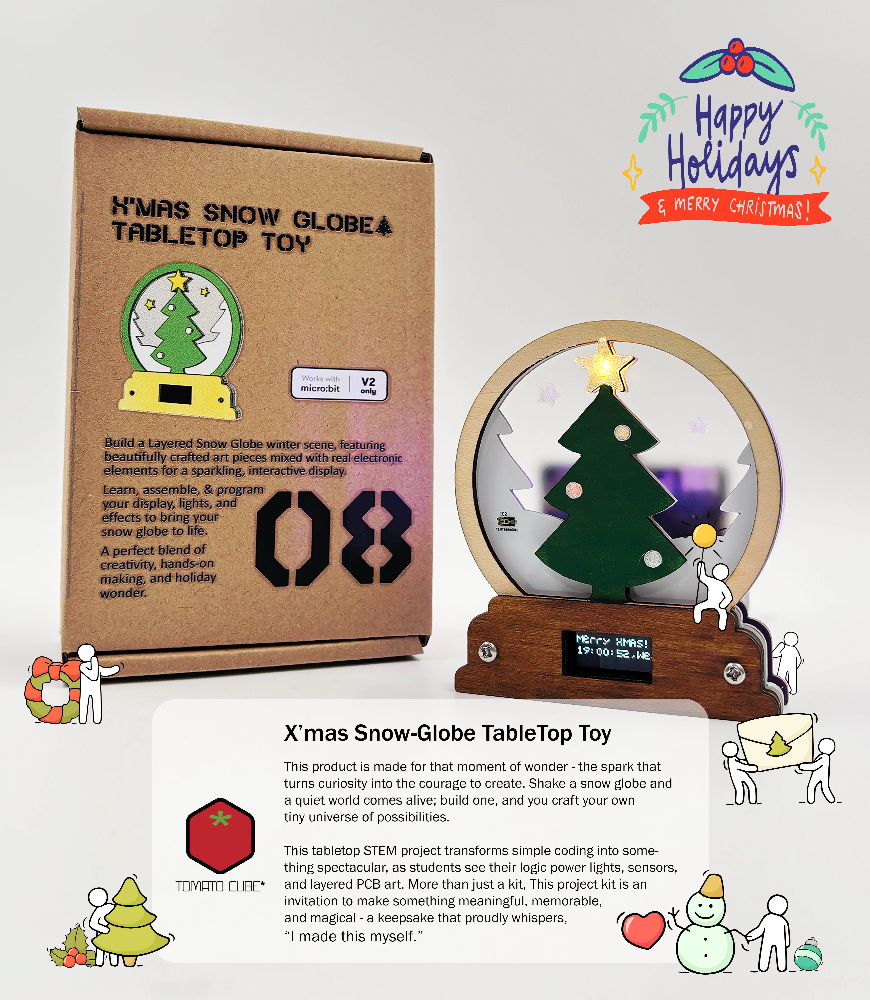

## Box08 - X'mas Snow Globe TableTop Toy

A programmable electronic snow globe with a festive winter scene, perfect for learning embedded systems and making your holiday decorations interactive. ❄️🎅✨ The SnowGlobe TableTop Toy comes in three different variants, each carefully thought out to align with various coding/maker skill level.
  

### Quick Start

Select your edition and follow the dedicated user guide to set up your snow globe:

- Micro:bit v2 Edition – Ideal for beginners **[User Manual](microbit%20v2%20Edition/Files/SnowGlobe_microBit_UserManual_v1.0.pdf)** 
- Raspberry Pi Pico Edition – Great for intermediate makers **[User Manual](Raspberry%20Pi%20Pico%20Edition/Files/SnowGlobe_Pico_UserManual_v1.0.pdf)**
- WCH CH32x033 Edition – For advanced tinkerers looking to stretch their engineering muscles **[User Manual](WCH%20CH32x033%20Edition/Files/SnowGlobe_WCH_UserManual_v1.0.pdf)**

  

### Comparing the Variants
The core experience is the same, but each variant uses a different microcontroller, programming language, and toolchain. Use the table below to choose the right one for you.

